English | [한국어](README.ko.md) | [中文](README.zh.md) | [日本語](README.ja.md) | [Español](README.es.md) | [Tiếng Việt](README.vi.md) | [Português](README.pt.md)

<p align="center">
  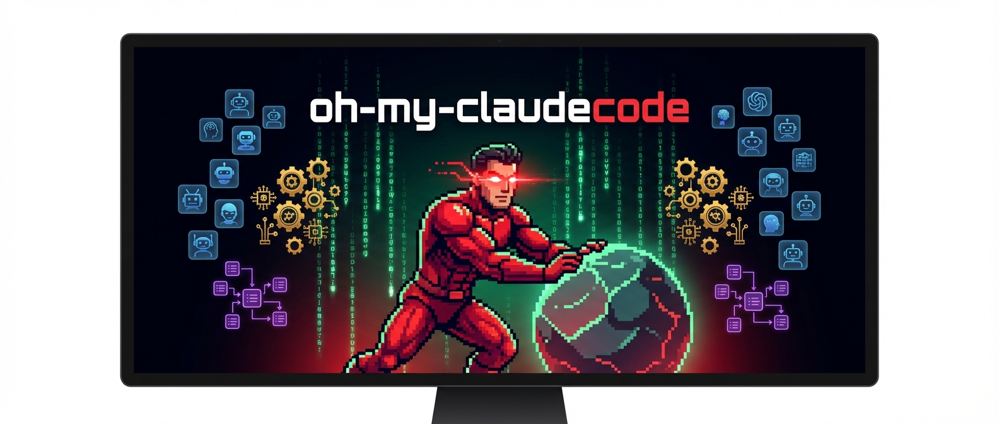
</p>

<h1 align="center">oh-my-claudecode</h1>

<p align="center">
  <strong>Multi-agent orchestration for Claude Code. Zero learning curve.</strong><br/>
  <em>Don't learn Claude Code. Just use OMC.</em>
</p>

<p align="center">
  <a href="https://www.npmjs.com/package/oh-my-claude-sisyphus"></a>
  <a href="https://www.npmjs.com/package/oh-my-claude-sisyphus"></a>
  <a href="https://github.com/Yeachan-Heo/oh-my-claudecode/stargazers"></a>
  <a href="https://github.com/Yeachan-Heo/oh-my-claudecode/blob/main/LICENSE"></a>
  
  <a href="https://github.com/Yeachan-Heo/oh-my-claudecode/actions"></a>
  <a href="https://discord.gg/PUwSMR9XNk"></a>
  
  <a href="https://github.com/sponsors/Yeachan-Heo"></a>
</p>

<p align="center">
  <a href="#quick-start">Get Started</a> &bull;
  <a href="https://yeachan-heo.github.io/oh-my-claudecode-website">Documentation</a> &bull;
  <a href="#architecture">Architecture</a> &bull;
  <a href="#execution-modes">Modes</a> &bull;
  <a href="#agent-catalog">Agents</a> &bull;
  <a href="https://discord.gg/PUwSMR9XNk">Discord</a>
</p>

---

## Table of Contents

- [What is oh-my-claudecode?](#what-is-oh-my-claudecode)
- [Quick Start](#quick-start)
- [Architecture](#architecture)
- [Execution Modes](#execution-modes)
- [Agent Catalog](#agent-catalog)
- [Skills System](#skills-system)
- [Hook Event Pipeline](#hook-event-pipeline)
- [State Management](#state-management)
- [Magic Keywords](#magic-keywords)
- [Configuration & Tooling](#configuration--tooling)
- [Requirements](#requirements)
- [FAQ](#faq)
- [Documentation](#documentation)
- [Contributing](#contributing)
- [Credits & License](#credits--license)

---

## What is oh-my-claudecode?

**oh-my-claudecode (OMC)** is a multi-agent orchestration layer for [Claude Code](https://docs.anthropic.com/claude-code) that transforms a single AI assistant into a coordinated team of 19 specialized agents, 31+ skills, and 8 execution modes — all activated by natural language.

Instead of manually prompting Claude Code for each subtask, OMC automatically delegates work to the right agent at the right model tier, verifies results, and persists until the job is done. It's like giving Claude Code a brain, a team, and a work ethic.

<p align="center">
  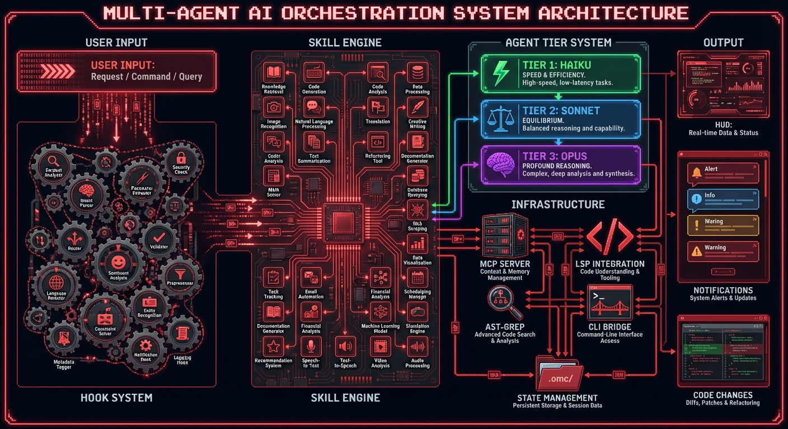
</p>

<table align="center">
  <tr>
    <td align="center"><strong>19</strong><br/>Specialized Agents</td>
    <td align="center"><strong>31+</strong><br/>Skills</td>
    <td align="center"><strong>8</strong><br/>Execution Modes</td>
    <td align="center"><strong>20</strong><br/>Lifecycle Hooks</td>
    <td align="center"><strong>3</strong><br/>Model Tiers</td>
  </tr>
</table>

### Why OMC?

| Feature | Without OMC | With OMC |
|---------|-------------|----------|
| **Task delegation** | Manual prompting for each subtask | Automatic routing to specialized agents |
| **Model selection** | One model for everything | Smart routing: Haiku (fast) / Sonnet (balanced) / Opus (deep) |
| **Persistence** | Agent stops when it wants | Ralph mode persists until verified complete |
| **Parallelism** | Sequential, one thing at a time | Ultrawork dispatches independent tasks in parallel |
| **Learning** | Start from scratch each session | Skills extracted from past sessions auto-inject |
| **Visibility** | Black box | HUD statusline shows live orchestration metrics |
| **Cost** | Full-price tokens for everything | 30-50% savings via intelligent model routing |
| **Multi-AI** | Claude only | Optional Codex + Gemini cross-validation via CCG |

> **For Codex users:** Check out [oh-my-codex](https://github.com/Yeachan-Heo/oh-my-codex) — the same orchestration experience for OpenAI Codex CLI.

---

## Quick Start

### Step 1: Install

**Marketplace plugin (recommended):**

```bash
/plugin marketplace add https://github.com/Yeachan-Heo/oh-my-claudecode
/plugin install oh-my-claudecode
```

**Or via npm:**

```bash
npm i -g oh-my-claude-sisyphus@latest
```

> **Package naming:** The project is branded as **oh-my-claudecode**, but the npm package is published as [`oh-my-claude-sisyphus`](https://www.npmjs.com/package/oh-my-claude-sisyphus).

### Step 2: Setup

```bash
/setup
# or
/omc-setup
```

### Step 3: Build something

```
autopilot: build a REST API for managing tasks
```

That's it. Everything else is automatic.

### Not sure where to start?

```
/deep-interview "I want to build a task management app"
```

The deep interview uses Socratic questioning to clarify your thinking before any code is written — exposing hidden assumptions and measuring clarity across weighted dimensions.

### Updating

<details>
<summary>Click to expand update instructions</summary>

**npm:**

```bash
npm i -g oh-my-claude-sisyphus@latest
```

**Marketplace:**

```bash
/plugin marketplace update omc
/setup
```

**Having issues?**

```bash
/omc-doctor
```

</details>

---

## Architecture

OMC is built on four interlocking systems that work together seamlessly:

<p align="center">
  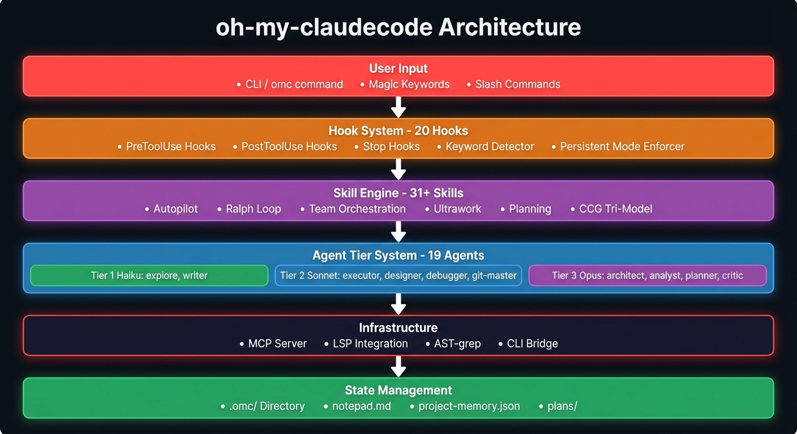
</p>

### The Four Systems

| System | Count | Role |
|--------|-------|------|
| **Hooks** | 20 | Intercept events (tool calls, stops, keywords) and inject context via `<system-reminder>` tags |
| **Skills** | 31+ | Behavior injection — from full autopilot to focused debugging workflows |
| **Agents** | 19 | Specialized workers across 3 model tiers (Haiku / Sonnet / Opus) |
| **State** | `.omc/` | Persistent storage: notepad, project memory, plans, session tracking |

### How Delegation Works

<p align="center">
  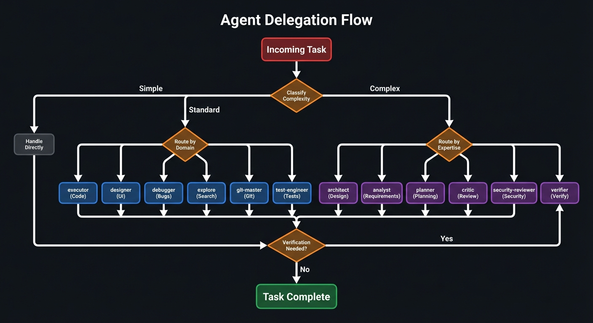
</p>

---

## Execution Modes

OMC provides 8 execution modes for different scenarios. Use the decision tree below to pick the right one:

<p align="center">
  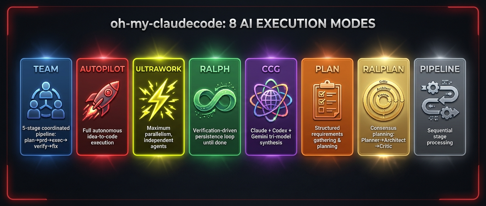
</p>

<p align="center">
  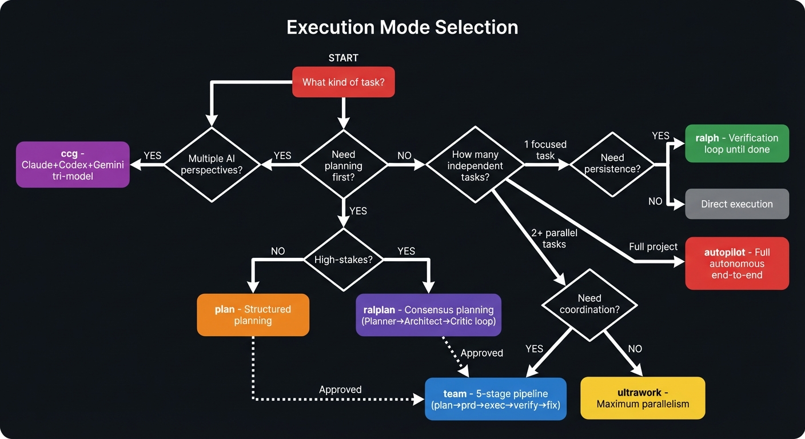
</p>

### Mode Comparison

| Mode | Parallelism | Pipeline | Persistence | Best For |
|------|:-----------:|:--------:|:-----------:|----------|
| **Team** (recommended) | High | `plan→prd→exec→verify→fix` | Yes | Coordinated multi-agent work |
| **omc team CLI** | High | tmux panes | Yes | Codex/Gemini CLI workers |
| **CCG** | Medium | `/ask codex` + `/ask gemini` | No | Cross-model validation |
| **Autopilot** | Medium | Single lead agent | Yes | End-to-end feature work |
| **Ultrawork** | Maximum | Independent agents | No | Burst parallel fixes |
| **Ralph** | Medium | Verify/fix loops | Yes | Must-complete tasks |
| **Plan/Ralplan** | N/A | Planning only | N/A | Requirements & architecture |
| **Pipeline** | Sequential | Strict ordering | No | Multi-step transformations |

### Team Mode (Recommended)

Starting in **v4.1.7**, **Team** is the canonical orchestration surface:

```bash
/team 3:executor "fix all TypeScript errors"
```

Team runs as a staged pipeline: `team-plan → team-prd → team-exec → team-verify → team-fix`

Enable native teams in `~/.claude/settings.json`:

```json
{
  "env": {
    "CLAUDE_CODE_EXPERIMENTAL_AGENT_TEAMS": "1"
  }
}
```

### tmux CLI Workers (v4.4.0+)

Spawn real tmux worker panes for Codex, Gemini, or Claude:

```bash
omc team 2:codex "review auth module for security issues"
omc team 2:gemini "redesign UI components for accessibility"
omc team 1:claude "implement the payment flow"
```

| Surface | Workers | Best For |
|---------|---------|----------|
| `omc team N:codex "..."` | N Codex CLI panes | Code review, architecture |
| `omc team N:gemini "..."` | N Gemini CLI panes | UI/UX, docs, large-context |
| `omc team N:claude "..."` | N Claude CLI panes | General tasks |
| `/ccg` | `/ask codex` + `/ask gemini` | Tri-model synthesis |

---

## Agent Catalog

<p align="center">
  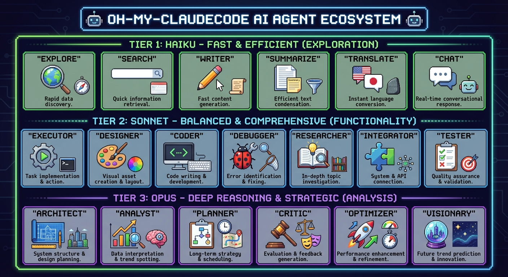
</p>

### Tier 1 — Haiku (Fast & Cheap)

| Agent | Purpose |
|-------|---------|
| **explore** | Codebase discovery and file search |
| **writer** | Documentation and technical writing |

### Tier 2 — Sonnet (Balanced)

| Agent | Purpose |
|-------|---------|
| **executor** | Code implementation and feature work |
| **designer** | UI/UX design and frontend components |
| **debugger** | Build error resolution and root cause analysis |
| **git-master** | Git operations, atomic commits, rebasing |
| **test-engineer** | Test strategy, integration/e2e coverage |
| **qa-tester** | Interactive CLI testing via tmux |
| **code-simplifier** | Code clarity and maintainability |
| **scientist** | Data analysis and research execution |
| **tracer** | Evidence-driven causal tracing |
| **document-specialist** | External API/SDK reference lookup |

### Tier 3 — Opus (Deep Reasoning)

| Agent | Purpose |
|-------|---------|
| **architect** | System design and strategic debugging |
| **analyst** | Requirements analysis and pre-planning |
| **planner** | Task sequencing and implementation planning |
| **critic** | Gap analysis, quality review, plan evaluation |
| **code-reviewer** | Comprehensive code review with severity ratings |
| **security-reviewer** | Security vulnerability detection (OWASP Top 10) |
| **verifier** | Evidence-based completion verification |

### Smart Model Routing

OMC automatically routes tasks to the optimal model tier:

```
Simple lookup → Haiku ($) — fast, cheap
Standard work → Sonnet ($$) — balanced
Deep analysis → Opus ($$$) — highest quality
```

This saves **30-50% on token costs** compared to using Opus for everything.

---

## Skills System

<p align="center">
  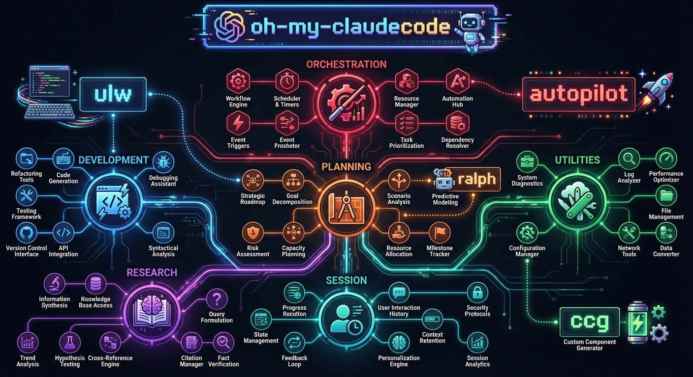
</p>

Skills are reusable behavior injections that auto-activate when relevant. OMC ships with 31+ built-in skills and supports custom skill creation.

### Built-in Skills by Category

| Category | Skills | Description |
|----------|--------|-------------|
| **Orchestration** | `autopilot`, `team`, `ultrawork`, `ralph`, `ccg`, `pipeline` | Execution mode controllers |
| **Planning** | `plan`, `ralplan`, `deep-interview`, `deep-dive` | Requirements gathering and consensus planning |
| **Development** | `debug`, `ai-slop-cleaner`, `learner`, `self-improve` | Code quality and pattern extraction |
| **Utilities** | `setup`, `cancel`, `hud`, `configure-notifications`, `mcp-setup` | Configuration and management |
| **Research** | `external-context`, `sciomc`, `ask` | Multi-source investigation |
| **Session** | `project-session-manager`, `deepinit`, `release`, `skill` | Project and session management |

### Custom Skills

Learn once, reuse forever. OMC extracts debugging knowledge into portable skill files:

| Scope | Path | Shared With | Priority |
|-------|------|-------------|----------|
| **Project** | `.omc/skills/` | Team (version-controlled) | Higher |
| **User** | `~/.omc/skills/` | All your projects | Lower |

```yaml
# .omc/skills/fix-proxy-crash.md
---
name: Fix Proxy Crash
description: aiohttp proxy crashes on ClientDisconnectedError
triggers: ["proxy", "aiohttp", "disconnected"]
source: extracted
---
Wrap handler at server.py:42 in try/except ClientDisconnectedError...
```

**Manage skills:** `/skill list | add | remove | edit | search`
**Auto-learn:** `/learner` extracts reusable patterns with strict quality gates
**Auto-inject:** Matching skills load into context automatically

### Skill Lifecycle

<p align="center">
  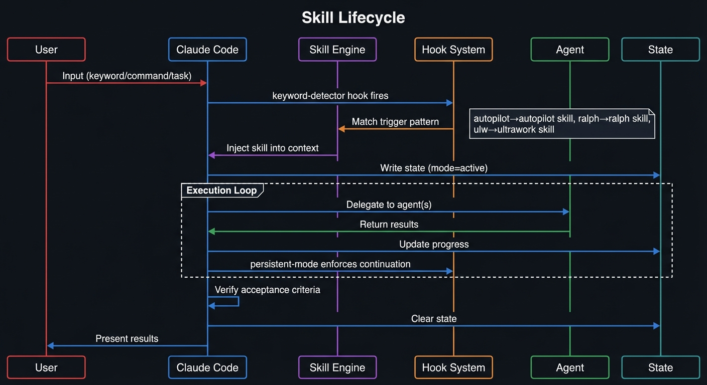
</p>

---

## Hook Event Pipeline

The hook system intercepts lifecycle events and injects context into the conversation via `<system-reminder>` tags:

<p align="center">
  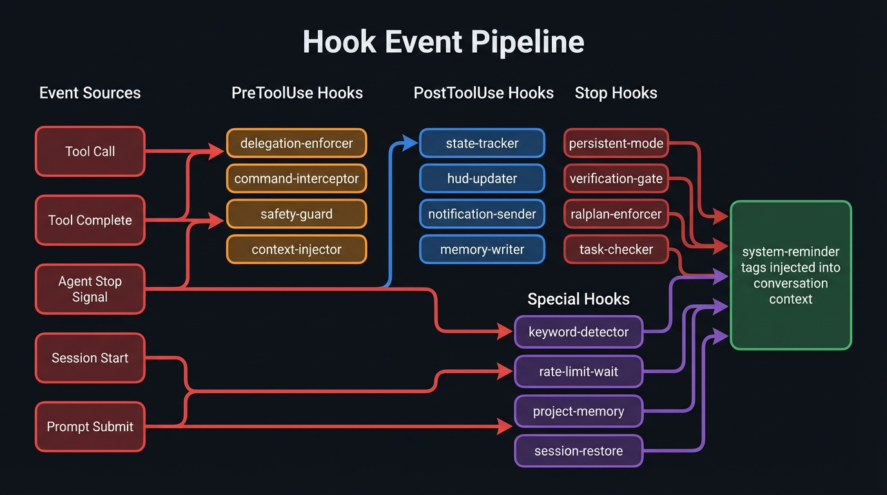
</p>

---

## State Management

OMC persists state across sessions in the `.omc/` directory:

<p align="center">
  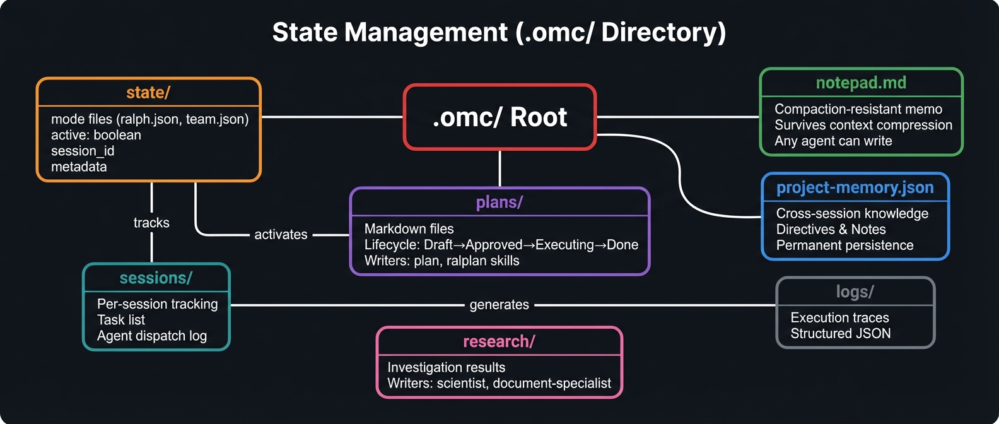
</p>

---

## Magic Keywords

Optional shortcuts for power users. Natural language works fine without them.

| Keyword | Effect | Example |
|---------|--------|---------|
| `team` | Canonical Team orchestration | `/team 3:executor "fix all TypeScript errors"` |
| `omc team` | tmux CLI workers | `omc team 2:codex "security review"` |
| `ccg` | Tri-model synthesis | `/ccg review this PR` |
| `autopilot` | Full autonomous execution | `autopilot: build a todo app` |
| `ralph` | Persistence mode (includes ultrawork) | `ralph: refactor auth` |
| `ulw` | Maximum parallelism | `ulw fix all errors` |
| `ralplan` | Consensus planning | `ralplan this feature` |
| `deep-interview` | Socratic requirements clarification | `deep-interview "vague idea"` |
| `deepsearch` | Codebase-focused search | `deepsearch for auth middleware` |
| `ultrathink` | Deep reasoning mode | `ultrathink about this architecture` |
| `cancelomc` | Stop active OMC modes | `cancelomc` |

---

## Configuration & Tooling

### HUD (Heads-Up Display)

Real-time orchestration metrics in your status bar:

```bash
/oh-my-claudecode:hud setup
```

### Notifications (Telegram / Discord / Slack)

```bash
omc config-stop-callback telegram --enable --token <bot_token> --chat <chat_id> --tag-list "@alice,bob"
omc config-stop-callback discord --enable --webhook <url> --tag-list "@here,123456789"
omc config-stop-callback slack --enable --webhook <url> --tag-list "<!here>,<@U1234567890>"
```

### Provider Advisor (`omc ask`)

Route prompts to any local AI CLI and save artifacts:

```bash
omc ask claude "review this migration plan"
omc ask codex --prompt "identify architecture risks"
omc ask gemini --prompt "propose UI polish ideas"
```

### Rate Limit Auto-Resume

```bash
omc wait --start   # Enable auto-resume daemon
omc wait --stop    # Disable daemon
```

### OpenClaw Integration

Forward session events to an [OpenClaw](https://openclaw.ai/) gateway:

```bash
/oh-my-claudecode:configure-notifications
# → When prompted, type "openclaw"
```

<details>
<summary>Manual OpenClaw setup</summary>

Create `~/.claude/omc_config.openclaw.json`:

```json
{
  "enabled": true,
  "gateways": {
    "my-gateway": {
      "url": "https://your-gateway.example.com/wake",
      "headers": { "Authorization": "Bearer YOUR_TOKEN" }
    }
  }
}
```

| Variable | Description |
|----------|-------------|
| `OMC_OPENCLAW=1` | Enable OpenClaw |
| `OMC_OPENCLAW_DEBUG=1` | Debug logging |
| `OMC_OPENCLAW_CONFIG=/path` | Override config path |

</details>

---

## Requirements

| Requirement | Required | Notes |
|-------------|:--------:|-------|
| [Claude Code](https://docs.anthropic.com/claude-code) CLI | Yes | Core dependency |
| Claude Max/Pro or API key | Yes | For model access |
| Node.js 20+ | Yes | Runtime |
| tmux | Recommended | Required for `omc team`, rate-limit detection |

### tmux Installation

| Platform | Install |
|----------|---------|
| macOS | `brew install tmux` |
| Ubuntu/Debian | `sudo apt install tmux` |
| Fedora | `sudo dnf install tmux` |
| Arch | `sudo pacman -S tmux` |
| Windows | `winget install psmux` ([native tmux](https://github.com/marlocarlo/psmux)) |
| Windows (WSL2) | `sudo apt install tmux` |

### Optional: Multi-AI Orchestration

OMC can optionally orchestrate external AI providers. These are **not required**.

| Provider | Install | What It Enables |
|----------|---------|-----------------|
| [Gemini CLI](https://github.com/google-gemini/gemini-cli) | `npm i -g @google/gemini-cli` | Design review, UI consistency (1M context) |
| [Codex CLI](https://github.com/openai/codex) | `npm i -g @openai/codex` | Architecture validation, code review |

---

## FAQ

<details>
<summary><strong>What's the difference between OMC and vanilla Claude Code?</strong></summary>

Claude Code is a single AI assistant. OMC adds an orchestration layer that turns it into a coordinated team of 19 specialized agents with automatic delegation, model routing, persistence, and parallel execution. Think of it as going from a solo developer to a full engineering team.

</details>

<details>
<summary><strong>Does OMC cost more to run?</strong></summary>

Actually less. Smart model routing (Haiku for simple tasks, Opus only when needed) saves 30-50% on tokens compared to using Opus for everything. You need a Claude Max/Pro subscription or API key — the same as vanilla Claude Code.

</details>

<details>
<summary><strong>Can I use OMC without tmux?</strong></summary>

Yes. Core features (agents, skills, magic keywords, autopilot, ralph) work without tmux. You only need tmux for `omc team` CLI workers and rate-limit auto-resume.

</details>

<details>
<summary><strong>How do I choose between Team, Autopilot, and Ralph?</strong></summary>

- **Team** — Multi-agent coordinated pipeline. Best for complex tasks requiring plan→execute→verify stages.
- **Autopilot** — Single lead agent, end-to-end. Best for feature work where you want minimal interaction.
- **Ralph** — Persistence loop. Best when a task absolutely must complete with verification.

When in doubt, use Team.

</details>

<details>
<summary><strong>What's the "Sisyphus" in the npm package name?</strong></summary>

The OMC mascot is inspired by Sisyphus — the mythological figure who never stops pushing the boulder. Like Sisyphus, OMC's Ralph mode never gives up until the task is verified complete. The npm package is `oh-my-claude-sisyphus` while the project is branded `oh-my-claudecode`.

</details>

<details>
<summary><strong>Can I create custom agents?</strong></summary>

OMC uses the 19 built-in agents which are optimized for their roles. You can create **custom skills** (`.omc/skills/`) that modify agent behavior and inject domain knowledge. Use `/learner` to extract skills from your sessions or `/skill add` to create them manually.

</details>

<details>
<summary><strong>How does OMC work with Codex and Gemini?</strong></summary>

OMC can spawn real Codex and Gemini CLI processes as tmux worker panes (`omc team N:codex "..."`) or use the `/ccg` skill for tri-model synthesis. These are optional — OMC works fully with just Claude.

</details>

---

## Documentation

| Resource | Description |
|----------|-------------|
| [Full Reference](docs/REFERENCE.md) | Complete feature documentation |
| [Architecture](docs/ARCHITECTURE.md) | How it works under the hood |
| [CLI Reference](https://yeachan-heo.github.io/oh-my-claudecode-website/docs.html#cli-reference) | All `omc` commands and flags |
| [Workflows](https://yeachan-heo.github.io/oh-my-claudecode-website/docs.html#workflows) | Battle-tested skill chains |
| [Release Notes](https://yeachan-heo.github.io/oh-my-claudecode-website/docs.html#release-notes) | What's new in each version |
| [Website](https://yeachan-heo.github.io/oh-my-claudecode-website) | Interactive guides |
| [Migration Guide](docs/MIGRATION.md) | Upgrade from v2.x |
| [Performance Monitoring](docs/PERFORMANCE-MONITORING.md) | Agent tracking & optimization |
| [Security Guide](SECURITY.md) | Enterprise deployment & hardening |

---

## Contributing

We welcome contributions of all kinds:

1. **Fork** the repo and create a feature branch
2. **Make** your changes with tests
3. **Submit** a pull request

See the [Discord](https://discord.gg/PUwSMR9XNk) for discussion and the [issues page](https://github.com/Yeachan-Heo/oh-my-claudecode/issues) for open tasks.

---

## Credits & License

### Core Maintainers

| Role | Name | GitHub |
|------|------|--------|
| Creator & Lead | Yeachan Heo | [@Yeachan-Heo](https://github.com/Yeachan-Heo) |
| Maintainer | HaD0Yun | [@HaD0Yun](https://github.com/HaD0Yun) |

### Ambassadors

| Name | GitHub |
|------|--------|
| Sigrid Jin | [@sigridjineth](https://github.com/sigridjineth) |

### Top Collaborators

| Name | GitHub |
|------|--------|
| riftzen-bit | [@riftzen-bit](https://github.com/riftzen-bit) |
| Seunggwan Song | [@nathan-song](https://github.com/nathan-song) |
| JunghwanNA | [@shaun0927](https://github.com/shaun0927) |
| Junho Yeo | [@junhoyeo](https://github.com/junhoyeo) |
| Alex Urevick-Ackelsberg | [@AlexUrevick](https://github.com/AlexUrevick) |

### Inspired By

[oh-my-opencode](https://github.com/code-yeongyu/oh-my-opencode) &bull; [claude-hud](https://github.com/ryanjoachim/claude-hud) &bull; [Superpowers](https://github.com/obra/superpowers) &bull; [everything-claude-code](https://github.com/affaan-m/everything-claude-code) &bull; [Ouroboros](https://github.com/Q00/ouroboros)

### License

MIT &copy; [Yeachan Heo](https://github.com/Yeachan-Heo)

---

<!-- OMC:FEATURED-CONTRIBUTORS:START -->
## Featured by OMC Contributors

Top personal non-fork, non-archived repos from all-time OMC contributors (100+ GitHub stars).

- [@Yeachan-Heo](https://github.com/Yeachan-Heo) — [oh-my-claudecode](https://github.com/Yeachan-Heo/oh-my-claudecode) (11k+)
- [@junhoyeo](https://github.com/junhoyeo) — [tokscale](https://github.com/junhoyeo/tokscale) (1.3k)
- [@psmux](https://github.com/psmux) — [psmux](https://github.com/psmux/psmux) (695)
- [@BowTiedSwan](https://github.com/BowTiedSwan) — [buildflow](https://github.com/BowTiedSwan/buildflow) (284)
- [@alohays](https://github.com/alohays) — [awesome-visual-representation-learning-with-transformers](https://github.com/alohays/awesome-visual-representation-learning-with-transformers) (268)
- [@jcwleo](https://github.com/jcwleo) — [random-network-distillation-pytorch](https://github.com/jcwleo/random-network-distillation-pytorch) (260)
- [@emgeee](https://github.com/emgeee) — [mean-tutorial](https://github.com/emgeee/mean-tutorial) (200)
- [@anduinnn](https://github.com/anduinnn) — [HiFiNi-Auto-CheckIn](https://github.com/anduinnn/HiFiNi-Auto-CheckIn) (172)
- [@Znuff](https://github.com/Znuff) — [consolas-powerline](https://github.com/Znuff/consolas-powerline) (145)
- [@shaun0927](https://github.com/shaun0927) — [openchrome](https://github.com/shaun0927/openchrome) (144)

<!-- OMC:FEATURED-CONTRIBUTORS:END -->

## Star History

[](https://www.star-history.com/#Yeachan-Heo/oh-my-claudecode&type=date&legend=top-left)

## Support This Project

If oh-my-claudecode helps your workflow, consider sponsoring:

[](https://github.com/sponsors/Yeachan-Heo)

**Why sponsor?** Keep development active &bull; Priority support &bull; Influence the roadmap &bull; Keep it free & open source

**Other ways to help:** Star the repo &bull; Report bugs &bull; Suggest features &bull; Contribute code
