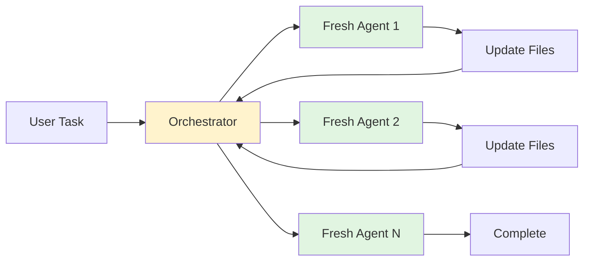
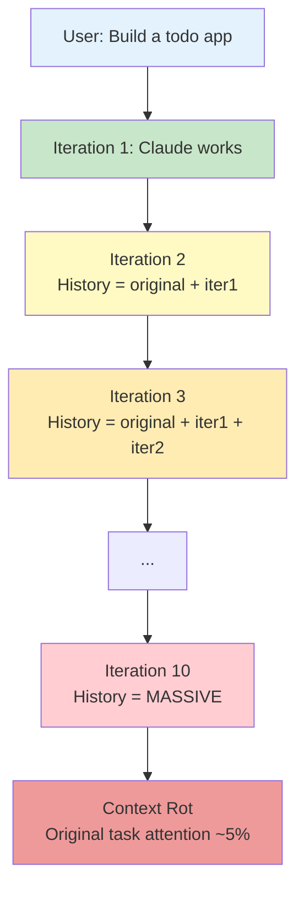
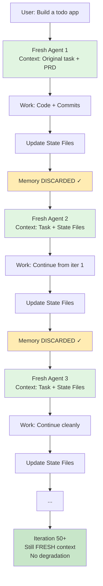
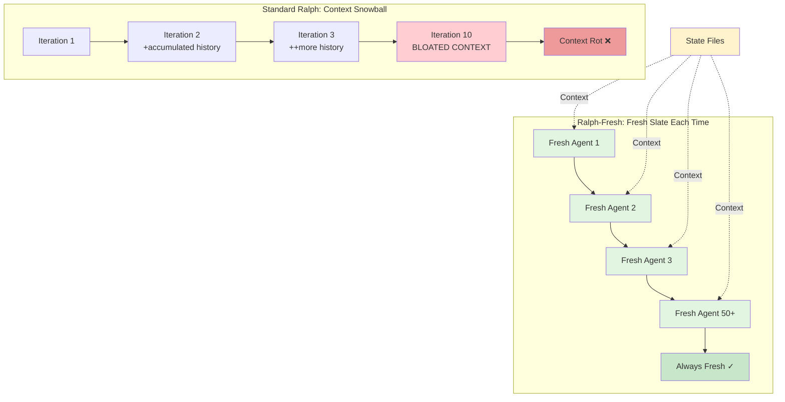
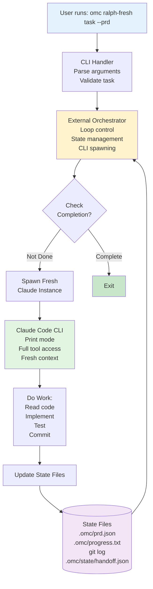
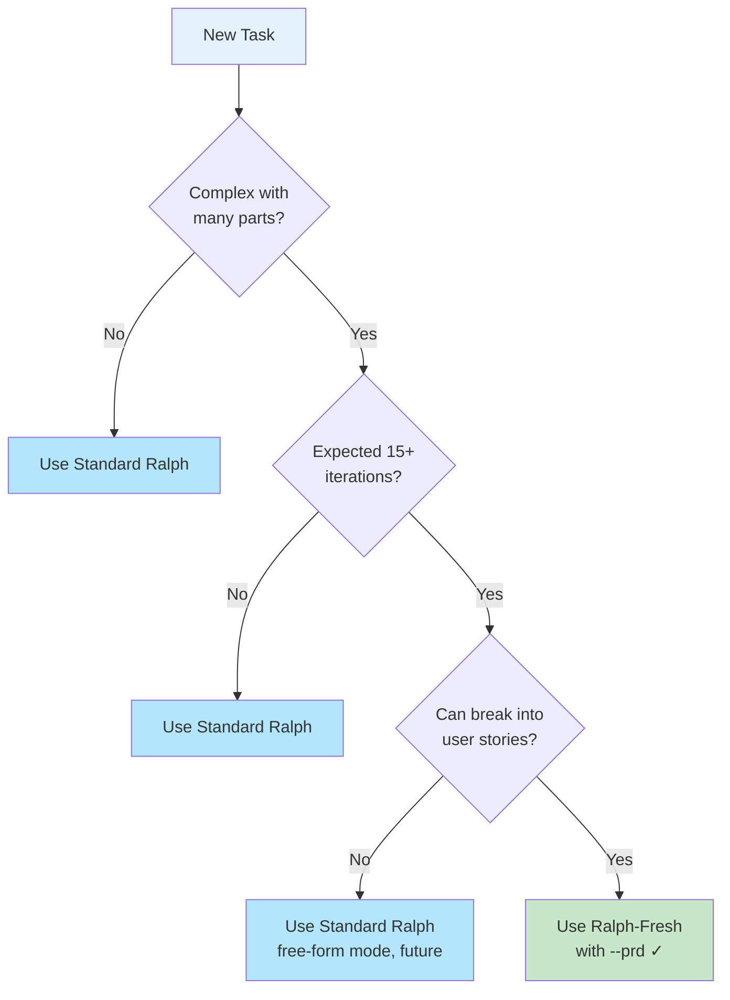

# Ralph-Fresh: Unlimited-Context AI Task Execution

A Whitepaper on Fresh-Context Iteration for Long-Running Agent Tasks

**Version**: 1.3
**Date**: January 2026
**Status**: Published

---

## Executive Summary

Ralph-Fresh solves a fundamental problem in AI-driven development: **context accumulation**. When AI agents work on complex tasks across many iterations, their conversation history grows, degrading attention and eventually hitting token limits. Ralph-Fresh bypasses this by spawning **fresh AI agents each iteration** with complete context passed through files, not conversation memory. This enables **unlimited-length task execution** without degradation—transforming a tool limited to 10-15 iterations into one capable of indefinite execution.

**The innovation**: External orchestrator pattern + handoff-based state passing = fresh context every iteration, zero accumulated conversation history.

---

## TL;DR

- **Problem**: AI agents accumulate conversation history, causing attention degradation after ~10 iterations
- **Solution**: Spawn fresh AI agents each iteration, pass context through files (not conversation memory)
- **Result**: Unlimited iterations without context rot—tasks that would fail at iteration 15 can now run indefinitely
- **How**: External orchestrator reads state from files (PRD, git, progress), spawns fresh Claude instance, repeats until complete
- **Best For**: Complex tasks requiring 15+ iterations (full applications, large refactors, extended debugging)

---

## Quick Reference Card

**For developers who need the essentials at a glance:**

### When to Use
- Task likely to take **15+ iterations**
- Complex tasks with many files/components
- Tasks where fresh context matters for sustained attention

### Command
```bash
# Basic usage
omc ralph-fresh "your task here"

# Recommended (structured)
omc ralph-fresh --prd "your task with clear breakdown"

# With custom iterations
omc ralph-fresh --prd "task" --max-iterations 50
```

### Key Files
| File | Purpose |
|------|---------|
| `.omc/prd.json` | User stories and completion status |
| `.omc/progress.txt` | Learnings and patterns discovered |
| `.omc/state/ralph-fresh-state.json` | Active mode state (iteration tracking) |
| `.omc/state/ralph-fresh-handoff.json` | Full handoff object (context transfer) |
| `.omc/state/iteration-prompt.txt` | Current iteration prompt (temp file) |

### Key Concepts
- **Fresh Context**: Each iteration starts with no conversation history—only essential state from files
- **Handoff Object**: JSON snapshot of PRD status, patterns, git history, and learnings
- **Stuck Detection**: Warns if task stalls on same story for 3+ iterations
- **PRD Mode**: Structured breakdown into user stories with clear completion criteria

### Quick Status Check
```bash
# What stories are done?
cat .omc/prd.json | jq '.userStories[] | {id, title, passes}'

# What patterns were learned?
cat .omc/progress.txt | head -20

# What work was done?
git log --oneline -10
```

---

## One-Minute Overview

**The Core Concept**: Instead of one long conversation that accumulates bloat, Ralph-Fresh uses **many short conversations** where each fresh AI agent receives only the essential context from files.



**The Simple Analogy**:
- **Standard Ralph** = Taking notes on the same paper (eventually runs out of room, gets messy)
- **Ralph-Fresh** = Fresh paper each time, but you copy forward only the important notes (clean slate, essential context preserved)

Each iteration gets a clean mental workspace while maintaining perfect continuity through external state files.

---

## PART 1: THE PROBLEM

### 1.1 Context Accumulation in AI Conversations

When a human and AI agent have an extended conversation:

1. Each message is added to the conversation history
2. The LLM (Large Language Model) reads the ENTIRE history on every response
3. The history grows exponentially with iterations
4. Eventually, the oldest messages receive degraded attention

**In standard Ralph** (the current implementation):



**Context accumulation visualization**: Each iteration adds to the conversation history, creating exponential growth that eventually drowns the original task in noise.

### 1.2 The Three Symptoms of Context Rot

| Symptom | Cause | Impact |
|---------|-------|--------|
| **Dilution** | Original task drowns in accumulated history | Focus shifts away from actual goal |
| **Repetition** | Earlier work forgotten, redone (redundantly) | Wasted iterations, slow progress |
| **Fragility** | Edge cases ignored, patterns forgotten | Code quality degrades over iterations |

### 1.3 Token Limits and Compaction

Claude operates within a token limit (e.g., 200K tokens):

- **Conversation history takes ~40% of the budget** immediately
- **Each iteration adds more tokens** to the history
- **After ~10 iterations, history dominates** the context window
- **Forced "compaction"** (LLM summarizes history) loses critical details
- **Result**: Task can't sustain more than 10-15 iterations without severe degradation

**Real-world impact**:
- Complex features taking 20+ iterations become impossible
- Large codebases with many components can't be fully refactored
- Long-running tasks hit a hard limit mid-execution

---

## PART 2: THE SOLUTION

### 2.1 The Core Insight: Fresh Context Per Iteration

What if each iteration **wasn't a continuation of a conversation**, but a **fresh conversation with complete context injected as data**?



**Key difference**: Context comes from **files and git history**, not conversation memory.

**Side-by-Side Comparison**:



### 2.2 How Ralph-Fresh Actually Works

Ralph-Fresh uses an **external orchestrator pattern** - a Node.js script that manages the loop rather than the AI agent itself:

```
User runs: omc ralph-fresh "build a todo app" --prd

                    ↓
         Orchestrator Script
         (.omc/state/ralph-fresh-state.json)
                    ↓
      Iteration 1: Spawn Fresh Claude Instance
      ├─ Input: Original task + PRD
      ├─ Claude works with full context
      ├─ Claude exits (OR times out)
      └─ Orchestrator reads git commits + state files
                    ↓
      Update Handoff State
      ├─ What stories completed?
      ├─ What patterns learned?
      ├─ What git commits made?
      └─ Check: Is task complete?
                    ↓
      Iteration 2: Spawn FRESH Claude Instance
      ├─ Input: Original task + updated handoff state
      ├─ No memory of iteration 1's thinking
      ├─ Full fresh attention to the work
      └─ ...repeat...
                    ↓
      Final: Detection of completion → orchestrator stops
```

### 2.3 The Handoff Object: Memory Without Conversation

Instead of storing memory in conversation history, Ralph-Fresh uses a **handoff object** - a JSON file that captures:

```json
{
  "iteration": 3,
  "original_prompt": "Build a REST API for todos with CRUD",
  "completed": false,

  "prd": {
    "storiesTotal": 5,
    "storiesCompleted": 2,
    "nextStoryId": "US-003",
    "incompleteIds": ["US-003", "US-004", "US-005"]
  },

  "progress": {
    "patterns": [
      "Use Express Router for route organization",
      "Validate requests with Zod",
      "Use bcrypt for password hashing"
    ],
    "recentLearnings": [
      "bcrypt.compare is async",
      "404 for not found (not 400)"
    ]
  },

  "git": {
    "recentCommits": [
      { "hash": "a1b2c3d", "message": "feat: add POST /todos endpoint" },
      { "hash": "e4f5g6h", "message": "feat: add GET /todos endpoint" }
    ],
    "hasUncommittedChanges": false
  }
}
```

**The Handoff Object contains**:
- ✅ What stories are done (from `.omc/prd.json`)
- ✅ What patterns were learned (from `.omc/progress.txt`)
- ✅ What code was written (from `git log`)
- ✅ What attempt was last made (last commits)

**The Handoff Object does NOT contain**:
- ❌ Conversation thinking or reasoning
- ❌ Exploration dead-ends
- ❌ Failed attempts
- ❌ Any context pollution

**Result**: Each iteration starts fresh with ONLY signal (what was completed), not noise (how it was done).

---

## PART 3: ARCHITECTURE & IMPLEMENTATION

### 3.1 System Architecture

Ralph-Fresh uses a **simple but elegant architecture**:



### 3.2 Components and Responsibilities

**External Orchestrator** (`scripts/ralph-fresh.ts`)
- Maintains the iteration loop
- Reads current state from files
- Spawns fresh Claude instances via CLI
- Detects completion
- Handles signals (Ctrl+C) gracefully

**Handoff State Manager** (`src/hooks/ralph/fresh-handoff.ts`)
- Read/write `.omc/state/ralph-fresh-state.json`
- Refresh state from `.omc/prd.json` and git
- Track stuck detection
- Error logging

**Prompt Generator** (`src/hooks/ralph/fresh-prompt.ts`)
- Create iteration-specific prompts
- Inject current state into prompt
- Warn about stuck stories
- Provide next task guidance

**CLI Handler** (`src/cli/commands/ralph-fresh.ts`)
- Parse user arguments
- Spawn orchestrator as external process
- Handle `--prd`, `--max-iterations`, `--verbose`
- Report completion status

### 3.3 Execution Flow in Detail

**Initialization**:

```typescript
// 1. User runs CLI
omc ralph-fresh "build a todo API" --prd

// 2. CLI handler:
//    - Parses arguments
//    - Initializes PRD (if --prd flag)
//    - Spawns external orchestrator

// 3. Orchestrator:
//    - Creates .omc/state/ralph-fresh-state.json
//    - Reads .omc/prd.json (5 user stories)
//    - Reads .omc/progress.txt (empty on first run)
//    - Sets iteration = 1
```

**Iteration Loop**:

```typescript
// Each iteration follows this pattern:

while (iteration <= maxIterations && !completed) {

  // Step 1: Refresh state from files
  handoff = readHandoff()
  handoff.prd = readPrd()           // US-001 complete, US-002 next
  handoff.progress = readProgress() // Patterns learned so far
  handoff.git = readGitLog()        // Last 5 commits

  // Step 2: Check if complete BEFORE spawning
  if (handoff.prd.storiesCompleted === handoff.prd.storiesTotal) {
    console.log("✅ All stories complete!")
    completed = true
    break
  }

  // Step 3: Generate iteration prompt
  // (Original task + current state + next story)
  prompt = generatePrompt(handoff)

  // Step 4: Spawn FRESH Claude instance
  // This is THE CRITICAL PART - fresh CLI process, fresh context
  result = spawn('claude', ['-p', '--allowedTools', ...])

  // Step 5: Check for completion signal
  if (result.includes('<promise>TASK_COMPLETE</promise>')) {
    completed = true
    break
  }

  // Step 6: Next iteration
  iteration++
}
```

**Claude's Work (Single Iteration)**:

```
1. Claude reads fresh context:
   - Original task: "Build a todo API"
   - Next story: "US-003: Add authentication"
   - Recent commits: [Add GET, Add POST, ...]
   - Patterns: [Use Express Router, Use Zod validation, ...]

2. Claude works:
   - Reads current code
   - Implements US-003 (auth)
   - Tests implementation
   - Makes atomic commits
   - Updates .omc/prd.json (US-003: passes: true)
   - Updates .omc/progress.txt (new patterns learned)

3. Claude exits naturally
   (Or times out after 100 turns)

4. Orchestrator reads state files to determine
   if task is complete
```

---

## PART 4: KEY CONCEPTS EXPLAINED

### 4.1 PRD Mode: Structured Breakdown

When you use the `--prd` flag, Ralph-Fresh structures the task into **user stories**:

```json
{
  "project": "Todo API",
  "userStories": [
    {
      "id": "US-001",
      "title": "Create database schema",
      "description": "Design and create PostgreSQL tables",
      "acceptanceCriteria": ["Tables created", "Migrations written"],
      "priority": 1,
      "passes": false
    },
    {
      "id": "US-002",
      "title": "Implement GET /todos",
      "passes": false
    },
    {
      "id": "US-003",
      "title": "Implement POST /todos with validation",
      "passes": false
    }
  ]
}
```

**Advantages**:
- ✅ Clear completion criteria (all stories pass)
- ✅ Each iteration knows exactly what to do next
- ✅ Progress is measurable ("3 of 5 complete")
- ✅ Stuck detection works (same story for 3+ iterations)
- ✅ Easy to restart if interrupted

### 4.2 Fresh Context Without Conversation

Comparison of context types:

| Aspect | Standard Ralph | Ralph-Fresh |
|--------|----------------|-------------|
| **Memory** | Conversation history (grows) | Handoff object (fixed size) |
| **Re-read** | LLM re-reads all history | Claude reads handoff object once |
| **Pollution** | Old failed attempts remain | Discarded each iteration |
| **Token cost** | History grows linearly | Handoff stays ~5KB |
| **After 10 iterations** | History = 30KB, context degraded | Fresh context, no degradation |
| **After 50 iterations** | Impossible (context limit) | Still fresh (no limit) |

### 4.3 Stuck Detection

Ralph-Fresh tracks when progress stalls:

```typescript
// Handoff tracks:
stuckDetection: {
  lastPrdStatus: ["US-003", "US-004", "US-005"],
  iterationsOnSameStory: 3
}
```

**If stuck ≥ 3 iterations on same story**:
- Orchestrator warns: "You've been on US-003 for 3 iterations"
- Next Claude instance receives warning in prompt
- Claude can attempt different approach or request help
- Human can intervene: simplify scope, clarify requirements

### 4.4 Atomic Commits: Proof of Work

Each iteration must make **atomic commits** (small, complete changes):

```bash
# Good commits (Ralph-Fresh expects these)
git commit -m "feat: add POST /todos endpoint"
git commit -m "feat: add input validation with Zod"
git commit -m "test: add tests for POST /todos"

# Bad commits (lose meaning between iterations)
git commit -m "WIP: working on auth"
git commit -m "debugging"
```

**Why commits matter**:
- ✅ Next iteration sees proof of work (what was done)
- ✅ Prevents duplication ("was this already done?")
- ✅ Easy rollback if mistake discovered
- ✅ Clear history for human review

---

## PART 5: HOW TO USE RALPH-FRESH

### 5.1 Basic Usage

**Start a fresh-context task**:

```bash
omc ralph-fresh "implement user authentication with JWT and password hashing"
```

**With PRD mode** (recommended):

```bash
omc ralph-fresh --prd "build a REST API with CRUD operations for tasks"
```

**With custom iterations**:

```bash
omc ralph-fresh "complex refactor" --prd --max-iterations 50
```

### 5.2 During Execution

What you'll see:

```
[Ralph Fresh] Starting fresh-context orchestration
[Ralph Fresh] Max iterations: 20
[Ralph Fresh] Stuck threshold: 3

[Ralph Fresh] === Iteration 1/20 ===
[Ralph Fresh] PRD Status: 0/5 stories complete
[Ralph Fresh] Spawning fresh Claude instance...
(Claude works...)
[Ralph Fresh] PRD Status: 1/5 stories complete

[Ralph Fresh] === Iteration 2/20 ===
[Ralph Fresh] PRD Status: 1/5 stories complete
[Ralph Fresh] Spawning fresh Claude instance...
(Claude works...)
[Ralph Fresh] PRD Status: 2/5 stories complete

[Ralph Fresh] === Iteration 3/20 ===
[Ralph Fresh] Completion promise detected!

[Ralph Fresh] ✅ COMPLETE after 3 iterations
```

### 5.3 Interrupting and Resuming

**If you press Ctrl+C**:

```
[Ralph Fresh] Received SIGINT, saving state and exiting...
[Ralph Fresh] State saved to .omc/state/ralph-fresh-state.json
```

State is preserved in `.omc/state/ralph-fresh-state.json`.

**To continue later**:

```bash
# Re-run the same command
omc ralph-fresh "build a REST API" --prd --max-iterations 20
```

Orchestrator detects existing state and resumes from where it left off.

### 5.4 Monitoring Progress

**Check PRD status**:

```bash
cat .omc/prd.json | jq '.userStories[] | {id, title, passes}'
```

**Check learnings**:

```bash
cat .omc/progress.txt | head -20
```

**Check recent work**:

```bash
git log --oneline -10
```

---

## PART 6: DECISION GUIDE

### When to Use Ralph-Fresh

Use **Ralph-Fresh** when:

| Criterion | Indicator |
|-----------|-----------|
| **Duration** | Task likely to take 15+ iterations |
| **Complexity** | Many files, multiple components, large codebase |
| **Context Sensitivity** | Need sustained attention to original task |
| **PRD Benefits** | Clear breakdown into stories possible |
| **Long-running** | Task could take hours of work |
| **Token Concerns** | Worried about context window limits |

**Example tasks for Ralph-Fresh**:
- Building a full-stack application (20+ iterations)
- Refactoring a large codebase (15+ iterations)
- Complex feature with multiple sub-tasks (12+ iterations)
- Long-running debugging sessions (10+ iterations minimum)

### When to Use Standard Ralph

Use **Standard Ralph** when:

| Criterion | Indicator |
|-----------|-----------|
| **Duration** | Expected to complete in <10 iterations |
| **Complexity** | Few files, single focus area |
| **Quick Fix** | Bug fix or small feature |
| **Simplicity** | Don't need PRD structure |
| **Speed** | Want immediate feedback within iteration |

**Example tasks for Standard Ralph**:
- Quick bug fixes (1-3 iterations)
- Small features (3-5 iterations)
- Documentation updates (1-2 iterations)
- Simple refactors (2-4 iterations)

### Decision Flowchart



---

## PART 7: TECHNICAL DEEP DIVE

### 7.1 Handoff Schema

**File**: `.omc/state/ralph-fresh-state.json`

```typescript
interface RalphFreshHandoff {
  // Orchestration Metadata
  version: '1.0';
  created_at: string;          // ISO timestamp
  iteration: number;           // Current iteration (1-indexed)
  max_iterations: number;      // Max before stopping

  // Original Task
  original_prompt: string;     // What user asked for
  completion_promise: string;  // Signal phrase (default: "TASK_COMPLETE")

  // Completion State
  completed: boolean;
  completion_message?: string;

  // PRD State (from .omc/prd.json)
  prd?: {
    project: string;
    branchName: string;
    description: string;
    storiesTotal: number;
    storiesCompleted: number;
    nextStoryId: string | null;
    incompleteIds: string[];
  };

  // Progress State (from .omc/progress.txt)
  progress: {
    patterns: string[];        // Codebase patterns
    recentLearnings: string[]; // Last 5 learnings
    lastCompletedStory?: string;
  };

  // Git State
  git: {
    recentCommits: Array<{
      hash: string;
      message: string;
    }>;
    branch: string;
    hasUncommittedChanges: boolean;
  };

  // Stuck Detection
  stuckDetection: {
    lastPrdStatus: string[];
    iterationsOnSameStory: number;
    lastActionAttempted?: string;
  };

  // Error Tracking
  lastError?: {
    iteration: number;
    message: string;
    recoveryAttempt?: string;
  };
}
```

### 7.2 Iteration Prompt Template

Each iteration sends Claude a fresh prompt:

```markdown
# Ralph Fresh Context - Iteration {{N}}/{{MAX}}

You are continuing work that was started by a previous agent iteration.
**Your context is completely fresh** - you have no memory of previous attempts.

## Your Task
{{original_prompt}}

## Current State (from files)

### PRD Status
Progress: {{completed}}/{{total}} stories complete
Next story: {{nextStoryId}}

### Recent Git History
{{#each recentCommits}}
- {{hash}}: {{message}}
{{/each}}

### Patterns Learned
{{#each patterns}}
- {{this}}
{{/each}}

## Your Mission

1. **READ** the codebase (start with .omc/prd.json)
2. **WORK** on story {{nextStoryId}}
3. **COMMIT** frequently with atomic commits
4. **UPDATE** prd.json when story complete (passes: true)
5. **SIGNAL** completion: <promise>TASK_COMPLETE</promise>

## Critical Rules

- **Trust git history** - Don't redo completed work
- **Focus on ONE story** - Complete fully before moving on
- **Commit frequently** - Proof of work for next iteration
- **Update state files** - prd.json and progress.txt are your memory
```

### 7.3 CLI Integration

The orchestrator spawns Claude via:

```bash
cat ".omc/state/iteration-prompt.txt" | claude -p \
  --allowedTools "Read,Edit,Write,Bash,Glob,Grep" \
  --output-format json \
  --max-turns 100
```

**Key flags**:
- `-p` / `--print` = Print mode (non-interactive)
- `--allowedTools` = Auto-approve tools without prompts
- `--max-turns` = Limit API calls per iteration (cost control)
- `--output-format json` = Structured output for parsing

**TypeScript Runner Detection**:

The CLI handler (`src/cli/commands/ralph-fresh.ts`) detects the appropriate runner with this priority:

1. **Compiled JavaScript** (`scripts/ralph-fresh.js`) - Most reliable for production
2. **Bun** (`bun scripts/ralph-fresh.ts`) - Fast, native TypeScript support
3. **tsx** (`tsx scripts/ralph-fresh.ts`) - Fallback TypeScript runner

If only the TypeScript source exists and no runner is available, the CLI displays installation instructions for bun or tsx.

### 7.4 State File Management

Ralph-Fresh uses a layered state system:

| File | Purpose | Format | Created By |
|------|---------|--------|-----------|
| `.omc/prd.json` | User stories + completion status | JSON | Initial PRD generation |
| `.omc/progress.txt` | Learnings and patterns | Markdown | Claude (each iteration) |
| `.omc/state/ralph-fresh-state.json` | Active mode tracking | JSON | Orchestrator |
| `.omc/state/ralph-fresh-handoff.json` | Full context handoff | JSON | Orchestrator |
| `.omc/state/iteration-prompt.txt` | Current iteration prompt | Text | Orchestrator (temp) |

**State vs. Handoff Files**:

The state file (`ralph-fresh-state.json`) is a lightweight marker:
```json
{
  "active": true,
  "started_at": "2026-01-28T15:14:03.376Z",
  "iteration": 1
}
```

The handoff file (`ralph-fresh-handoff.json`) contains the full context snapshot (see Section 7.1).

**Update flow per iteration**:

```
Orchestrator reads:
├─ .omc/prd.json → Parse story statuses
├─ .omc/progress.txt → Extract patterns/learnings
└─ git log → Recent commits

Orchestrator creates handoff object with above data

Orchestrator spawns Claude with handoff in prompt

Claude updates:
├─ .omc/prd.json (sets passes: true for completed stories)
└─ .omc/progress.txt (adds new patterns/learnings)

Claude exits

Orchestrator reads updated files to build next handoff
```

### 7.5 Mode Registry Integration

Ralph-Fresh is registered in the centralized mode registry (`src/hooks/mode-registry/index.ts`), which provides:

**Mutual Exclusion**:
Ralph-Fresh cannot run while these modes are active:
- `autopilot` - Full autonomous execution
- `ultrapilot` - Parallel autopilot
- `swarm` - Coordinated agent swarm
- `pipeline` - Sequential agent chain
- `ralph` - Standard Ralph (same-context)

The CLI handler checks for conflicts before starting:
```typescript
if (isModeActive('ralph', cwd)) {
  console.error('Standard Ralph is currently active');
  console.error('Cancel first with: /oh-my-claudecode:cancel');
  process.exit(1);
}
```

**State Detection**:
Other modes can check if Ralph-Fresh is active via:
```typescript
import { isModeActive } from './mode-registry';

if (isModeActive('ralph-fresh', cwd)) {
  // Ralph-Fresh is running
}
```

**Unified Cancellation**:
Ralph-Fresh can be cancelled via the unified cancel skill:
```bash
/oh-my-claudecode:cancel
```

### 7.6 Error Handling and Recovery

Ralph-Fresh handles several failure modes:

| Error | Detection | Recovery |
|-------|-----------|----------|
| **CLI timeout** | 45-min execution limit | Log, continue next iteration |
| **Tool concurrency error** | API Error 400 | Retry up to 3 times |
| **Stuck on story** | Same story >3 iterations | Warn in prompt, let Claude attempt recovery |
| **Ctrl+C (SIGINT)** | Signal handler | Save state, exit gracefully |
| **Git corruption** | `git status` fails | Log error, continue with last known state |
| **PRD parse failure** | JSON parse error | Use last known PRD state |

### 7.7 Known Limitations (v0.1)

1. **No Resume Support**: State is saved but requires re-running from iteration 1
2. **PRD Mode Only**: Free-form task mode deferred to v0.2
3. **No Auto-Skip**: Stuck stories just receive warnings, no auto-skip logic
4. **60-Second Overhead**: Claude CLI has known ~60s latency bug (Jan 2026)
5. **No SDK Fallback**: Uses CLI only; Agent SDK integration deferred
6. **No Per-Iteration Verification**: Final verification only, not per-iteration

### 7.8 Future Enhancements (v0.2+)

| Feature | Scope | Impact |
|---------|-------|--------|
| **Resume Support** | Load state, continue from iteration N | No need to restart from iteration 1 |
| **Free-Form Mode** | Task completion via heuristics | Works without PRD structure |
| **Auto-Skip Stuck** | After N iterations, skip to next story | Prevents infinite loops |
| **SDK Fallback** | Use Claude Agent SDK if CLI fails | More robust, no CLI latency bug |
| **Cost Tracking** | Log API usage per iteration | Understand expense per task |
| **Per-Iteration Verification** | Architect verification each iteration | Catch issues earlier |

---

## PART 8: IMPLEMENTATION DETAILS

### 8.1 Files to Create

The Ralph-Fresh implementation consists of 6 files:

**Core Types** (`src/hooks/ralph/fresh.ts`):
- `RalphFreshHandoff` interface
- `RalphFreshConfig` interface
- Helper functions for state detection

**State Management** (`src/hooks/ralph/fresh-handoff.ts`):
- `initHandoff()` - Create new handoff
- `readHandoff()` - Load from disk
- `writeHandoff()` - Save to disk
- `refreshHandoffFromFiles()` - Update from PRD/progress/git

**Prompt Generation** (`src/hooks/ralph/fresh-prompt.ts`):
- `generateIterationPrompt()` - Create iteration-specific prompt
- Template rendering with current state

**Orchestrator** (`scripts/ralph-fresh.ts`):
- Main loop control
- Claude CLI spawning
- Completion detection
- Signal handlers (Ctrl+C)
- Error handling + retries

**CLI Handler** (`src/cli/commands/ralph-fresh.ts`):
- Parse user arguments
- Spawn orchestrator as external process
- Route `--prd`, `--max-iterations` options

**CLI Registration** (`src/cli/index.ts`):
- Register `ralph-fresh` command with commander.js
- Dispatch to CLI handler

### 8.2 Sequence of Execution

```
1. User: omc ralph-fresh --prd "build a todo app"
                    ↓
2. CLI handler parses: { prompt, prd: true, maxIterations: 20 }
                    ↓
3. Spawn scripts/ralph-fresh.ts as external Node process
                    ↓
4. Orchestrator:
   a. Check no conflict with standard ralph
   b. Initialize .omc/prd.json (if --prd)
   c. Create initial handoff object
   d. Enter loop: iteration 1..max
                    ↓
5. Per iteration:
   a. Read .omc/prd.json (story status)
   b. Read .omc/progress.txt (learnings)
   c. Read git log (recent commits)
   d. Build handoff object
   e. Generate iteration prompt
   f. Execute: claude -p "$(cat prompt)" --allowedTools ...
   g. Check for completion signal OR PRD complete
   h. If complete: exit. Otherwise: iteration++
                    ↓
6. Claude's work (inside iteration):
   a. Read handoff object from prompt
   b. Understand what stories are done
   c. Work on next story
   d. Make atomic commits
   e. Update .omc/prd.json (mark story complete)
   f. Update .omc/progress.txt (add learnings)
   g. Exit naturally
                    ↓
7. Orchestrator (after iteration):
   a. Read updated .omc/prd.json
   b. Check: All stories done?
   c. If yes: cleanup, exit. If no: next iteration
```

### 8.3 Configuration

**Default Configuration**:

```typescript
const DEFAULT_FRESH_CONFIG = {
  maxIterations: 20,           // Max iterations before stopping
  maxTurnsPerIteration: 100,   // Max Claude API turns per iteration
  completionPromise: 'TASK_COMPLETE',  // Signal phrase
  workingDir: process.cwd(),
  verbose: false,              // Debug logging
  retryAttempts: 3,            // Retry on API errors
  retryDelayMs: 5000,          // Delay between retries
  stuckThreshold: 3            // Warn if stuck this many iterations
};
```

**User Overrides**:

```bash
omc ralph-fresh "task" \
  --prd \
  --max-iterations 50 \
  --verbose
```

---

## PART 9: COMPARISON TABLE

### Ralph-Fresh vs Standard Ralph: Detailed

| Aspect | Standard Ralph | Ralph-Fresh |
|--------|---|---|
| **Context Model** | Same-context, accumulating | Fresh context each iteration |
| **Memory** | Conversation history | Handoff file + git history |
| **Context Size** | Grows linearly (10KB → 50KB → ...) | Fixed (~5KB handoff) |
| **Attention Degradation** | YES (after ~10 iterations) | NO (fresh every iteration) |
| **Max Iterations** | ~10-15 before degradation | 50+ with no degradation |
| **Use Case** | Quick features, bug fixes | Complex features, full builds |
| **PRD Support** | Basic | Full with story tracking |
| **Stuck Detection** | Implicit | Explicit with thresholds |
| **Token Cost** | Lower initially, higher long-term | Higher initial, flat long-term |
| **Completion Detection** | Architect verification | PRD completion + signal |
| **State Persistence** | Single `.omc/ralph-state.json` | `.omc/state/ralph-fresh-state.json` + PRD |
| **Resume Support** | Yes (v1) | Deferred to v0.2 |
| **Orchestration** | Hook-based (same process) | External script (separate process) |

---

## PART 10: APPENDIX

### A. Glossary

**Handoff Object**: JSON file containing complete state snapshot (iteration, PRD status, progress, git, errors)

**Fresh Context**: AI agent starting with no conversation history, receiving only data-based state injection

**PRD Mode**: Structured task execution using Product Requirements Document with user stories

**Orchestrator**: External Node.js process that manages the iteration loop

**Stuck Detection**: Tracking when progress stalls (same story for N iterations)

**Atomic Commit**: Small, complete code change describing a single feature or fix

**Completion Signal**: Special tag (`<promise>TASK_COMPLETE</promise>`) indicating task is done

**Context Rot**: Degradation of LLM attention as conversation history grows

### B. Source Code References

| Component | File | Lines | Purpose |
|-----------|------|-------|---------|
| Core Types | `src/hooks/ralph/fresh.ts` | ~247 | Handoff and config interfaces, detection helpers |
| State Ops | `src/hooks/ralph/fresh-handoff.ts` | ~296 | Read/write/refresh handoff, PRD/git integration |
| Prompts | `src/hooks/ralph/fresh-prompt.ts` | ~176 | Iteration prompt generation |
| Orchestrator | `scripts/ralph-fresh.ts` | ~442 | Main loop, CLI spawning, error handling |
| CLI Wrapper | `src/cli/commands/ralph-fresh.ts` | ~182 | User-facing command, runner detection |
| Mode Registry | `src/hooks/mode-registry/index.ts` | ~492 | Centralized mode state, mutual exclusion |

### C. Configuration Files

Files created/used by Ralph-Fresh:

```
Project Root
├── .omc/
│   ├── prd.json                      # User stories + status
│   ├── progress.txt                  # Learnings and patterns
│   └── state/
│       ├── ralph-fresh-state.json    # Active mode marker
│       ├── ralph-fresh-handoff.json  # Full context handoff
│       └── iteration-prompt.txt      # Temp prompt file
├── scripts/
│   ├── ralph-fresh.ts                # Orchestrator script (TypeScript)
│   └── ralph-fresh.js                # Orchestrator script (compiled)
└── src/
    ├── hooks/
    │   ├── ralph/
    │   │   ├── fresh.ts              # Types + detection helpers
    │   │   ├── fresh-handoff.ts      # State operations
    │   │   ├── fresh-prompt.ts       # Prompt generation
    │   │   ├── prd.ts                # PRD reading
    │   │   └── progress.ts           # Progress/learnings
    │   └── mode-registry/
    │       ├── index.ts              # Mode state detection
    │       └── types.ts              # Mode registry types
    └── cli/
        └── commands/
            └── ralph-fresh.ts        # CLI wrapper + runner detection
```

### D. Research & Design Documents

**Original Research Plan**: `.omc/ralph-fresh-context-plan.md`

This whitepaper is based on 5 iterations of research and architectural review:

1. **Iteration 1**: Research & Problem Definition
2. **Iteration 2**: Detailed Architecture Design
3. **Iteration 3**: CLI Verification & Implementation Details
4. **Iteration 4**: Concrete Implementation Plan
5. **Iteration 5**: Final Architect Review

Status: **APPROVED for implementation**

### E. Example Usage Scenarios

**Scenario 1: Building a REST API**

```bash
omc ralph-fresh --prd "Build a REST API for a note-taking app with:
- Create/read/update/delete notes
- User authentication with JWT
- Search functionality
- Rate limiting"
```

Expected: 8-12 iterations over 30-60 minutes

**Scenario 2: Large Refactoring**

```bash
omc ralph-fresh --prd "Refactor auth system to use OAuth2:
- Replace JWT with OAuth2 flow
- Update login/signup endpoints
- Migrate user session data
- Update documentation"
```

Expected: 6-10 iterations over 20-40 minutes

**Scenario 3: Complex Debugging**

```bash
omc ralph-fresh "Debug and fix race condition in payment processing:
- Identify root cause
- Add transaction locking
- Add comprehensive tests
- Verify with load test"
```

Expected: 4-8 iterations over 15-30 minutes

### F. FAQ

**Q: How much does Ralph-Fresh cost compared to Standard Ralph?**

A: Each iteration costs roughly 2-3x more (Opus model, multiple turns), but you need far fewer iterations due to no degradation. Net cost depends on task complexity.

**Q: Can I stop Ralph-Fresh mid-task and resume later?**

A: Yes, state is saved to `.omc/state/ralph-fresh-state.json`. In v0.1, you re-run the same command. In v0.2, explicit `--resume` flag will be added.

**Q: What happens if Claude gets stuck on a story?**

A: Orchestrator detects after 3 iterations on same story. Next iteration receives warning in prompt. Claude can attempt different approach or request human guidance.

**Q: Is Ralph-Fresh suitable for small tasks?**

A: No. Use Standard Ralph for tasks under 10 iterations. Ralph-Fresh shines on 15+ iteration tasks where context accumulation would otherwise limit you.

**Q: What if I need to interrupt (Ctrl+C)?**

A: Ralph-Fresh catches SIGINT, saves state gracefully, and exits. Your work isn't lost—re-run the command to continue.

**Q: How do I know if a task is complete?**

A: In PRD mode: all user stories marked complete. Ralph-Fresh also detects explicit completion signal: `<promise>TASK_COMPLETE</promise>`

**Q: Can I use Ralph-Fresh without PRD mode?**

A: Not yet. v0.1 requires PRD mode for structured completion detection. Free-form mode coming in v0.2.

**Q: What's the maximum number of iterations?**

A: Default is 20, configurable up to any number. No hard limit, though 50+ iterations is unusual.

---

## Conclusion

Ralph-Fresh represents a fundamental shift in how AI agents handle long-running tasks: **fresh context per iteration instead of accumulated memory**. By externalizing orchestration and passing state through files, we eliminate context rot while maintaining complete situational awareness.

This enables the vision of truly autonomous long-running agents—work that previously would have degraded after 10 iterations can now sustain indefinitely with fresh attention and full capability.

For tasks of moderate-to-high complexity (8+ hours of work), Ralph-Fresh provides the foundation for reliable, attention-preserving autonomous execution.

---

**Document Version**: 1.3
**Last Updated**: January 2026
**Status**: Published (Implementation Sync)
**Changes in 1.3**: Updated to reflect actual implementation - TypeScript runner detection, mode registry integration, state file separation (state vs. handoff), accurate file paths
**Next Review**: v0.2 release (post-implementation feedback)
